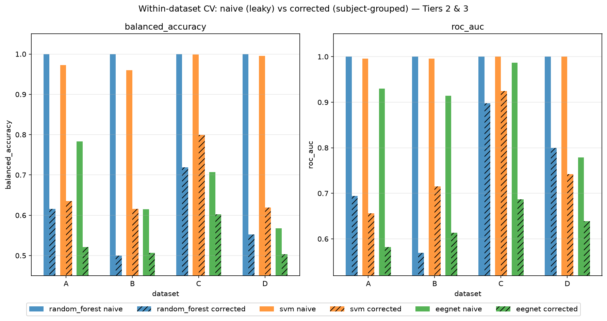
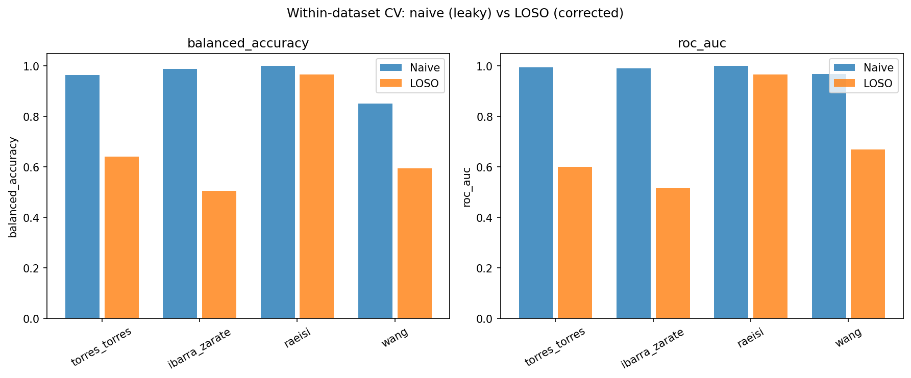
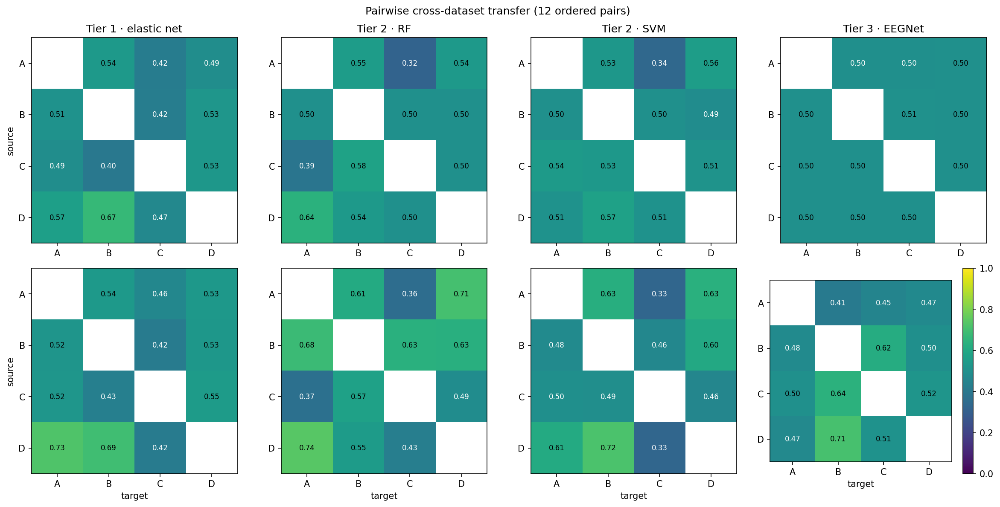
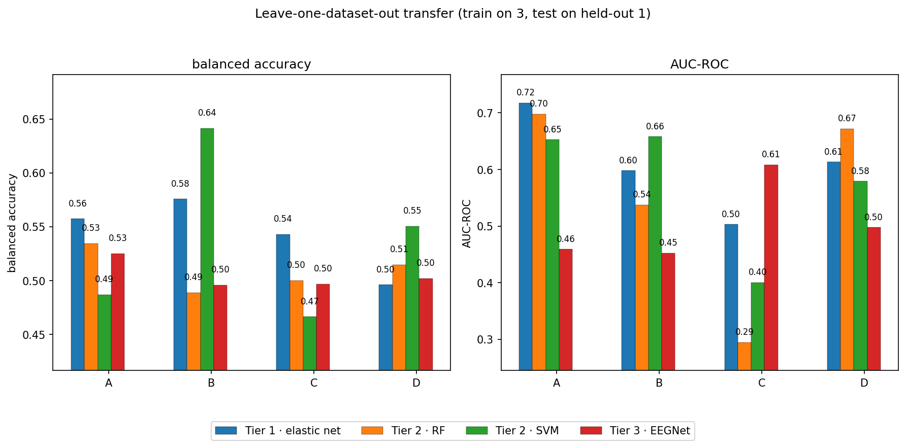
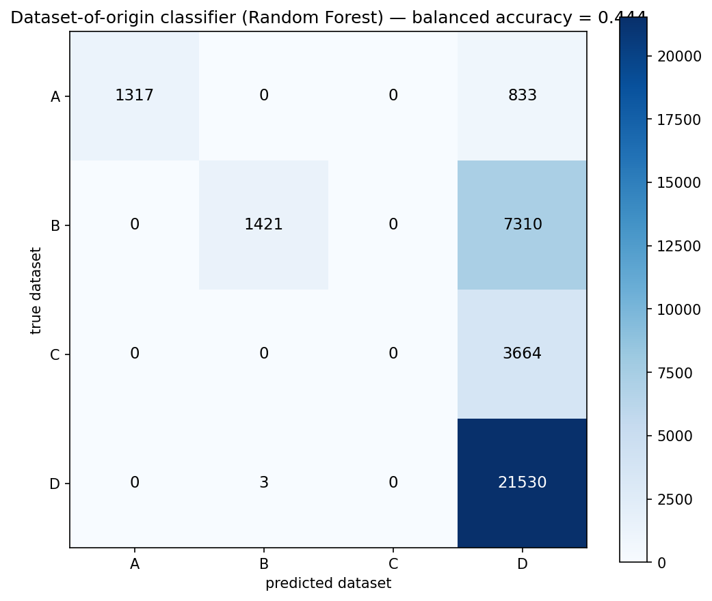
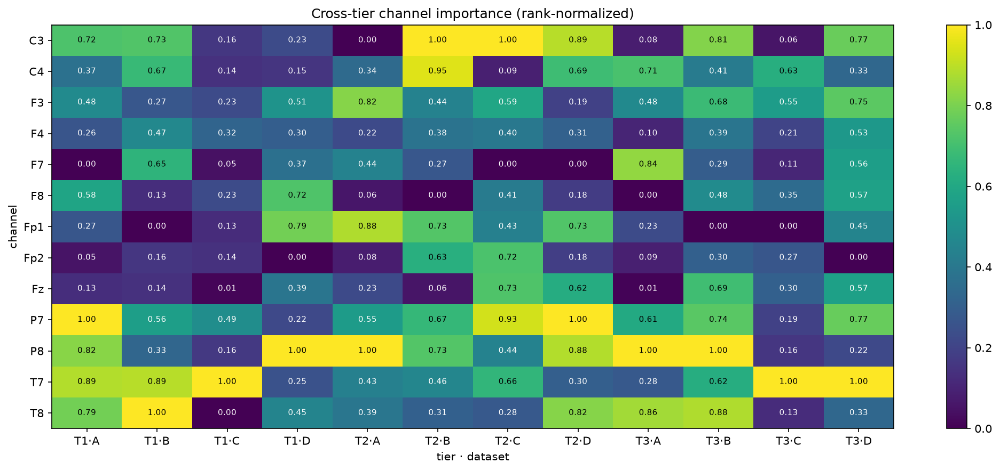

# Tinnitus EEG Classification: Power/Interpretability Tradeoff & Cross-Dataset Generalization

[](https://github.com/SDevrajK/tinnitus-eeg-classification/actions/workflows/ci.yml)

A reproducible machine-learning pipeline that classifies tinnitus vs. healthy controls from resting-state EEG across four public datasets, and that explicitly tests three methodological validity questions: subject-level leakage, cross-dataset generalization, and the interpretability-vs-complexity tradeoff.

## Summary

This project builds a four-tier model comparison — statistical baseline, sparse linear, classical nonlinear, and deep learning — and evaluates every predictive tier with the same rigorous validation schemes. The headline findings are sobering and reproducible: (1) engineered-feature models reach *perfect* accuracy under naive (leaky) cross-validation and collapse toward chance once subjects are separated between train and test; (2) no tier generalizes across independently collected datasets (pairwise and leave-one-dataset-out transfer are both near chance); and (3) increased model complexity does **not** buy more generalizable interpretability — the models do not agree on which channels matter, either across model families or across recording sites.

**Jump to:** [Datasets](#datasets) · [Methodology](#methodology) · [Leakage](#leakage-naive-vs-corrected-cross-validation) · [Cross-dataset generalization](#cross-dataset-generalization-pairwise-transfer--lodo) · [Confound check](#dataset-of-origin-confound-check) · [Interpretability](#interpretability-synthesis--complexity-tradeoff) · [Limitations](#limitations) · [Reproducibility](#reproducibility)

## Motivation

Published tinnitus-EEG classifiers report high accuracy (a 2026 systematic review and meta-analysis reports a pooled ~86.2% accuracy, AUC 0.878). But most of this literature uses small samples (often *n* < 40–100) and cross-validation schemes that do **not** separate subjects between the train and test partitions. Epochs from the same subject share subject-specific signal — most strikingly, the phase-lag-index (wPLI) connectivity features are literally identical across a subject's epochs — so a model that sees a subject's epochs in both train and test can partly learn *subject identity* rather than the tinnitus/control class, inflating the score.

Multiple recent papers and reviews (Liu et al. 2021; Ramezani & Bolhasani 2023; a 2026 arXiv cross-dataset study) explicitly flag this as a validity problem: reported accuracy tends to drop, sometimes toward chance, once subject-level leakage is removed, or once a model is evaluated on a second, independently collected dataset. The cross-dataset work further shows that when datasets differ in recording hardware and protocol, part of what looks like "generalizable" signal can instead be *dataset-specific* (site/platform) distributional shift rather than class-related signal.

This project therefore measures, explicitly and quantitatively: (a) the accuracy inflation attributable to subject-level leakage; (b) cross-dataset generalization via pairwise transfer and leave-one-dataset-out; (c) whether cross-dataset results could instead be explained by the datasets simply being technically distinguishable from one another; and (d) whether increasing model complexity buys generalizable insight, or merely fits dataset-specific noise.

## Datasets

Four independent public datasets, restricted to the resting-state, eyes-open condition. Each dataset carries its own documented, published sample size, but not every documented subject survives this project's data-quality checks (a missing recording, a duplicate file, an incompatible electrode montage, or an insufficient amount of usable data). **The subject counts below are the analytic N actually used for feature extraction and every downstream model** — not the originally documented total — since that is the number that determines everything reported in this README from here on. The full accounting of what was excluded and why is in [Limitations](#limitations).

- **Dataset A** — Torres-Torres et al., "Characterization of Tinnitus Through the Analysis of Electroencephalographic Activity," Mendeley Data, DOI 10.17632/fj7sskjdt7.5 (CC BY 4.0). **37 subjects (15 control / 22 tinnitus)** — no exclusions.
- **Dataset B** — Ibarra-Zárate et al., "Acoustic Therapies for Tinnitus Treatment: An EEG Database," Mendeley Data, DOI 10.17632/kj443jc4yc (CC BY 4.0); week-1 (pre-treatment) baseline session only. Documented as 103 subjects; 2 have no baseline recording at all and 3 more use an incompatible electrode montage (see [Limitations](#limitations)). **98 analytic subjects (14 control / 84 tinnitus).**
- **Dataset C** — Raeisi, "EEG signal dataset in a resting state for individuals with tinnitus and healthy individuals," Zenodo, DOI 10.5281/zenodo.13308645 (CC BY 4.0). Documented as 36 subjects; 11 are duplicate recordings removed during preprocessing (see [Limitations](#limitations)). **25 analytic subjects (15 control / 10 tinnitus).**
- **Dataset D** — Wang et al., "Cross-Subject Tinnitus Diagnosis Based on Multi-Band EEG Contrastive Representation Learning," IEEE Journal of Biomedical and Health Informatics 2023, DOI 10.1109/JBHI.2023.3264521 (distributed via the authors' Google Drive). 267 acquired subjects; 29 excluded for under 90 s of usable post-artifact-rejection data (see [Limitations](#limitations)). **238 analytic subjects (65 control / 173 tinnitus).**

All cross-dataset analyses (pairwise transfer, LODO, the dataset-of-origin confound check, and the interpretability agreement analysis) are restricted to the intersection of the **13 shared 10-20 channels** present in all four datasets: C3, C4, F3, F4, F7, F8, Fp1, Fp2, Fz, P7, P8, T7, T8.

## Methodology

**Preprocessing.** All four datasets' native formats (GDF/SET for A/B, NPZ for C, already-epoched EEGLAB SET/FDT for D) are loaded into a consistent MNE representation. Datasets A, B, and C are bandpass-filtered (0.5–45 Hz) and notch-filtered (50 Hz) with automated, non-manual artifact rejection; Dataset D is used as distributed, since it arrives already filtered, artifact-rejected, and epoched by Wang et al. (2023)'s own pipeline. All continuous recordings are segmented into fixed 2-second epochs (Dataset D keeps its own existing epoch boundaries).

**Four model tiers.** Tier 0 (statistical baseline): per-feature permutation *t*-tests with Benjamini–Hochberg FDR correction. Tier 1 (sparse linear): elastic-net-regularized logistic regression. Tier 2 (classical nonlinear): Random Forest and RBF-kernel Support Vector Machine. Tier 3 (deep learning): EEGNet-8,2 (Lawhern et al. 2018) trained directly on minimally processed epoch time series.

**Features (Tiers 0–2).** Per epoch and per shared channel (13 channels): band power in five canonical bands (delta 1–4 Hz, theta 4–8 Hz, alpha 8–13 Hz, beta 13–30 Hz, gamma 30–45 Hz — 65 features), weighted phase-lag index (wPLI) connectivity between every channel pair per band (78 pairs × 5 bands = 390 features), and permutation Lempel-Ziv complexity (PLZC) per channel, broadband (13 features). **468 features per epoch in total**, following a `{family}_{band}_{channel(s)}` naming scheme, e.g. `power_alpha_C3`, `wpli_beta_F3_F4`, `plzc_Fz`. Tier 3 bypasses this feature matrix entirely and ingests the raw (minimally processed) 2-second epochs directly.

**Validation.** Every predictive tier is evaluated three ways: (1) *within-dataset* — naive epoch-level cross-validation vs. corrected subject-grouped cross-validation, reporting balanced accuracy and AUC-ROC; (2) *pairwise cross-dataset transfer* — train on one dataset, test on another, for all 12 ordered pairs; and (3) *leave-one-dataset-out (LODO)* — train on the union of three datasets, test on the fully held-out fourth. Hyperparameter selection uses nested, subject-grouped cross-validation with fixed random seeds throughout, so the whole pipeline is reproducible.

## Leakage: naive vs. corrected cross-validation

The single largest methodological issue in the tinnitus-EEG literature is subject-level leakage. We quantify it directly by running every tier under both a *naive* (leaky, epoch-level) and a *corrected* (subject-grouped) cross-validation, holding everything else fixed.

**Tiers 2 and 3** (balanced accuracy / AUC-ROC, naive → corrected):

| Dataset | Model | Naive BA | Naive AUC | Corrected BA | Corrected AUC |
|---------|-------|----------|-----------|--------------|---------------|
| A (Torres-Torres) | Random Forest | 1.00 | 1.00 | 0.62 | 0.69 |
| A | SVM | 0.97 | 1.00 | 0.63 | 0.66 |
| A | EEGNet | 0.78 | 0.93 | 0.52 | 0.58 |
| B (Ibarra-Zárate) | Random Forest | 1.00 | 1.00 | 0.50 | 0.57 |
| B | SVM | 0.96 | 1.00 | 0.62 | 0.72 |
| B | EEGNet | 0.61 | 0.91 | 0.51 | 0.61 |
| C (Raeisi) | Random Forest | 1.00 | 1.00 | 0.72 | 0.90 |
| C | SVM | 1.00 | 1.00 | 0.80 | 0.93 |
| C | EEGNet | 0.71 | 0.99 | 0.60 | 0.69 |
| D (Wang) | Random Forest | 1.00 | 1.00 | 0.55 | 0.80 |
| D | SVM | 0.99 | 1.00 | 0.62 | 0.74 |
| D | EEGNet | 0.57 | 0.78 | 0.50 | 0.64 |

**Tier 1** (elastic net, naive vs. leave-one-subject-out):

| Dataset | Naive BA | Naive AUC | Corrected BA | Corrected AUC |
|---------|----------|-----------|--------------|---------------|
| A | 0.96 | 0.99 | 0.63 | 0.60 |
| B | 0.99 | 0.99 | 0.51 | 0.52 |
| C | 1.00 | 1.00 | 0.80 | 0.76 |
| D | 0.85 | 0.97 | 0.59 | 0.67 |





The pattern is stark and consistent: the engineered-feature models (Random Forest and SVM) reach **perfect (1.00) balanced accuracy** under naive CV and collapse toward chance under corrected CV — e.g. Random Forest falls from 1.00 to as low as 0.50 on Dataset B, a ~50-point inflation. EEGNet, trained on raw EEG, leaks less subject identity (the raw time series carries less subject-specific structure than the wPLI features), but it also extracts less signal — its corrected scores sit near 0.50–0.60. Only Dataset C (raeisi) is separable above chance once leakage is removed.

## Cross-dataset generalization: pairwise transfer & LODO

Leakage correction is necessary but not sufficient: a model can pass a corrected within-dataset test and still fail on new recording environments. We test this two ways.

**Pairwise transfer.** For each of the 12 ordered dataset pairs, a model trained on the entirety of the source dataset is tested on the entirety of the target dataset, for every tier. Balanced accuracy across all tiers and pairs ranges from ~0.32 to ~0.67, and AUC-ROC from ~0.41 to ~0.73 — i.e. essentially at chance for most pairs, and well below the corrected within-dataset scores.



**Leave-one-dataset-out (LODO).** For each of the 4 configurations, a model is trained on the union of the other three datasets (with subject-stratified epoch capping and class weighting) and tested on the fully held-out dataset. Balanced accuracy / AUC-ROC:

| Held out | Tier 1 (elastic net) | Tier 2 (RF) | Tier 2 (SVM) | Tier 3 (EEGNet) |
|----------|----------------------|-------------|--------------|-----------------|
| A | 0.56 / 0.72 | 0.53 / 0.70 | 0.49 / 0.65 | 0.53 / 0.46 |
| B | 0.58 / 0.60 | 0.49 / 0.54 | 0.64 / 0.66 | 0.50 / 0.45 |
| C | 0.54 / 0.50 | 0.50 / 0.29 | 0.47 / 0.40 | 0.50 / 0.61 |
| D | 0.50 / 0.61 | 0.51 / 0.67 | 0.55 / 0.58 | 0.50 / 0.50 |



Both schemes tell the same story: **no tier generalizes across datasets.** The apparent within-dataset signal is largely dataset-specific, not a stable neural marker of tinnitus. The next section rules out the alternative explanation — that this is simply because the datasets are trivially separable by hardware/site.

## Dataset-of-origin confound check

If the four datasets were trivially separable from their engineered features, then the cross-dataset transfer failures would be uninformative — the models could just be learning "which site," not "tinnitus vs. control." To test this, we trained a 4-class Random Forest to predict *which dataset* an epoch came from, using the same engineered features as the tinnitus classifiers, with subject-grouped cross-validation.

The dataset-of-origin classifier achieves a **balanced accuracy of 0.44** — only *moderately* above the 0.25 chance level for 4 classes. The confusion matrix shows the misclassification is largely one-directional into Dataset D: raeisi (C) is almost entirely misclassified as wang (D) (3,664/3,664 epochs), and a large share of ibarra (B) also lands in wang (7,310 epochs), while torres (A) and wang (D) are identified more reliably.



The implication for the transfer results is important: because the datasets are only *moderately* distinguishable (0.44, far from ceiling), the near-chance cross-dataset transfer reflects genuinely weak generalizable class signal, **not** a trivial site/hardware confound. If the datasets had been near-perfectly separable, the transfer failures would carry little information. As it stands, they are a meaningful — and sobering — measure of weak generalization. (The moderate separability does still imply *some* site-specific signal exists, so it is not entirely absent.)

## Interpretability synthesis & complexity tradeoff

Finally, we ask whether the models *agree* on which neural features matter. We aggregate each tier's interpretability to a common **channel level** (the 13 shared channels) — elastic-net coefficient magnitudes for Tier 1, RF/SVM importance for Tier 2, EEGNet spatial-filter magnitudes for Tier 3 — and rank-normalize each (tier, dataset) so the tiers are comparable.



Agreement, measured by Spearman rank correlation and top-5 channel overlap:

- **Cross-dataset agreement is low.** Spearman correlations are mostly near zero (roughly −0.42 to +0.63; means ~0.02–0.26 across tiers), and top-5 channel overlap is correspondingly low (Jaccard ~0.11–0.67). The channels flagged as important in one dataset are not reliably flagged in the others.
- **Cross-tier agreement is moderate and variable** (up to ~0.70 for RF/SVM ↔ EEGNet on Dataset A, but near zero on Dataset D). Different model families only partly agree even *within* a site.

### Conclusion: does complexity buy generalizable interpretability?

**No.** Increasing model complexity (Tier 3 vs. Tiers 0–1) does not yield more generalizable interpretability. The channels flagged as important in one dataset are not reliably flagged in the others, and the model families only partially agree even within a dataset. Combined with the near-chance cross-dataset generalization, the evidence is that the higher-complexity models — and, to a large extent, the simpler ones too — are fitting dataset-specific signal rather than discovering stable, generalizable neural markers of tinnitus. For this task, on this data, model complexity buys neither better generalization nor more trustworthy explanations.

## Limitations

This project tries to be candid about known data-quality and methodological caveats — consistent with its own thesis that the tinnitus-EEG literature under-reports exactly this kind of limitation. None of the items below change the headline findings above; they are documented so a reader can independently judge the reliability of each dataset's contribution to those findings.

- **Dataset B: permanent 2-subject gap + 3-subject montage exclusion.** Two subjects (`G1-Placebo/P2`, `G2-BBT/P1`) have no week-1 baseline recording in the raw source at all — a gap in the original data, not a processing artifact, and not recoverable. Three further subjects (`P18G2`, `P4G5`, `P5G5`) use a non-standard fronto-central electrode montage that cannot be reduced to the 13-channel shared set and are excluded from all processing. Net effect: 103 documented subjects → 98 analytic (14 control / 84 tinnitus).
- **Dataset C: 11 duplicate recordings.** Ten tinnitus recordings (`T11`–`T20`) are float32 re-saves of `T1`–`T10` (Pearson r = 1.0000 against the originals), and one control recording (`H14`) is byte-identical to `H13`. All 11 are dropped so the analytic sample reflects unique recordings only: 36 documented subjects → 25 analytic (15 control / 10 tinnitus).
- **Dataset C: eyes-open/eyes-closed condition is an unconfirmed working assumption.** Each subject's file contains a single ~5-minute segment with no embedded event markers or condition labels. The dataset depositor was contacted to confirm the condition; as of this writing, no response has been received. This project proceeds on the working assumption that the segment is eyes-open, consistent with the dataset's stated resting-state design. If this assumption is later found to be wrong, Dataset C's role in every cross-dataset analysis (pairwise transfer, LODO, dataset-of-origin, interpretability agreement) would need to be revisited, since eyes-open vs. eyes-closed is itself a well-documented EEG confound (posterior alpha power is substantially enhanced with eyes closed; Barry et al., 2007, *Clinical Neurophysiology*).
- **Dataset D: residual duration confound.** Even after excluding the 29 subjects with under 90 s of usable post-artifact-rejection data, retained Control subjects still have systematically less usable data than retained Tinnitus subjects (median 106 s vs. 192 s, measured across all 267 acquired subjects before exclusion). A stricter duration cutoff would have disproportionately removed Dataset D's already-scarce control group, so this confound is documented rather than fully corrected.
- **No scripted data acquisition.** Datasets A–C currently require a manual download from their respective repositories, and Dataset D requires manually placing its already-acquired files in the expected directory layout (see [Reproducibility](#reproducibility)). Only the analysis pipeline itself (feature extraction onward) is fully scripted and containerized end to end.

## Reproducibility

**Continuous integration.** Every push and pull request to `main` lints the codebase (`ruff`) and builds the Docker image below, then runs a pytest smoke-test suite (`tests/test_pipeline.py`) inside the container against a small committed fixture (`tests/fixtures/`) spanning preprocessing → feature extraction → model training. See the badge at the top of this README or [`.github/workflows/ci.yml`](.github/workflows/ci.yml). This is deliberately a smoke test, not a large unit-test bank — it confirms the pipeline still runs end to end after a change, not the correctness of every individual function.

**Acquiring the raw data.** Datasets A–C are downloaded manually from the repositories cited in [Datasets](#datasets) above (Mendeley Data for A/B, Zenodo for C); there is no scripted downloader yet (see [Limitations](#limitations)). Dataset D has no versioned-repository API and must be manually placed under the data directory's `wang/` subfolder in the layout `organize_bids.py` expects, per the authors' own Google Drive distribution.

**Pipeline scripts.** Once raw data is in place, the following scripts, run in order from `scripts/` under `conda activate tinnitus-eeg`, take it from raw files to every figure and table above:

| Stage | Scripts |
|-------|---------|
| Organize / inventory raw data | `organize_bids.py`, `generate_inventory.py` |
| Preprocess | `preprocess_raw.py` (Datasets A–C), `preprocess_wang.py` (Dataset D), `compute_shared_channels.py`, `exclude_subjects.py`, `generate_qc_figures.py` |
| Feature extraction | `build_feature_matrix.py` |
| Tier 0 (statistical) | `permutation_ttest.py`, `plot_topography.py`, `plot_wpli_heatmap.py`, `plot_plzc_topography.py` |
| Tier 1 (linear) | `robust_scaling.py`, `train_elastic_net.py`, `extract_coefficients.py`, `within_dataset_cv.py`, `pairwise_transfer.py`, `lodo_transfer.py`, `dataset_of_origin.py`, `bootstrap_stability.py`, `cross_dataset_figure.py` |
| Tier 2 (nonlinear) | `train_random_forest.py`, `train_svm.py`, `within_dataset_naive_cv.py`, `within_dataset_corrected_cv.py`, `compute_tier2_importance.py`, `map_tier2_importance.py`, `plot_tier2_importance.py` |
| Tier 3 (deep) | `train_eegnet.py`, `compute_eegnet_saliency.py`, `extract_eegnet_spatial_filters.py`, `plot_eegnet_interpretability.py` |
| Cross-dataset validation + confound check | `pairwise_transfer_tier{1,2,3}.py`, `lodo_transfer_tier{2,3}.py`, `dataset_of_origin_rf.py` |
| Figures + synthesis | `plot_naive_vs_corrected.py`, `plot_pairwise_transfer.py`, `plot_lodo_transfer.py`, `plot_dataset_of_origin.py`, `synthesize_interpretability.py`, `plot_interpretability_heatmap.py`, `assess_interpretability_agreement.py` |

`run_pipeline.sh` runs the feature-extraction-through-synthesis stages (everything from `build_feature_matrix.py` onward) in this order automatically.

**Docker.** The container runs the pipeline end-to-end starting from *cleaned data* (preprocessed `.fif` epochs and feature matrices already present, per the Preprocess stage above); raw-data acquisition itself is the separate, partly manual step described above and is not part of the containerized run.

Build the image:

```bash
docker build -t tinnitus-eeg .
```

Run it with the data directory and the repository mounted:

```bash
docker run -it \
  -v /home/sdevrajk/media-hdd/researchdata/personal/MachineLearning/data:/home/sdevrajk/media-hdd/researchdata/personal/MachineLearning/data \
  -v "$(pwd)":/workspace \
  -w /workspace \
  tinnitus-eeg bash
```

Inside the container, activate the environment and run the full pipeline (feature extraction through interpretability synthesis):

```bash
source activate tinnitus-eeg && cd scripts && bash ../run_pipeline.sh
```
